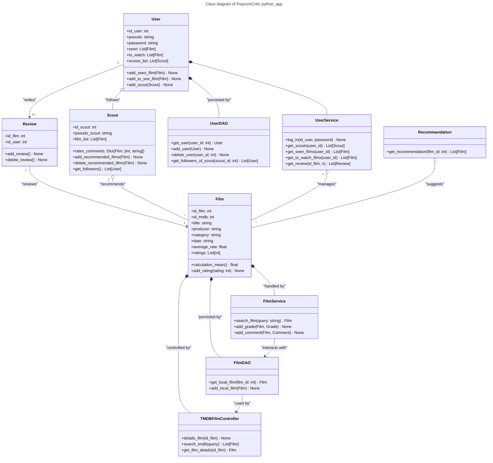

# Class diagramm

```mermaid
---
title: Class diagram of PopcornCritic python_app
---
classDiagram
    class Film {
        +id_film: int
        +id_tmdb: int
        +title: string
        +producer: string
        +category: string
        +date: string
        +average_rate: float
        +ratings: List[int]
        +calculation_mean() float
        +add_rating(rating: int) None
    }

    class Review {
        +id_film: int
        +id_user: int
        +add_review() None
        +delete_review() None
    }

    class User {
        +id_user: int
        +pseudo: string
        +password: string
        +seen: List[Film]
        +to_watch: List[Film]
        +scouts_list: List[Scout]
        +add_seen_film(Film) None
        +add_to_see_film(Film) None
        +add_scout(Scout) None
    }

    class Scout {
        +id_scout: int
        +pseudo_scout: string
        +film_list: List[Film]
        +rates_comments: Dict(Film, [int, string])
        +add_recommended_films(Film) None
        +delete_recommended_films(Film) None
        +get_followers() List[User]
    }

    class FilmDAO {
        +get_local_film(film_id: int) Film
        +add_local_film(Film) None
    }

    class FilmService {
        +search_film(query: string) Film
        +add_grade(Film, Grade) None
        +add_comment(Film, Comment) None
    }

    class UserDAO {
        +get_user(user_id: int) User
        +add_user(User) None
        +delete_user(user_id: int) None
        +get_followers_of_scout(scout_id: int) List[User]
    }

    class UserService {
        +log_in(id_user, password) None
        +get_scouts(user_id) List[Scout]
        +get_seen_films(user_id) List[Film]
        +get_to_watch_films(user_id) List[Film]
        +get_review(id_film, n) List[Review]
    }

    class Recommandation {
        +get_recommendation(film_id: int) List[Film]
    }

    class TMDBFilmController {
        +details_film(id_film) None
        +search_tmdb(query) List[Film]
        +get_film_details(id_film) Film
    }

%% Relations entre les classes
User *-- UserService
User "1" --> "0..*" Review : "writes"
Review "1" --> "1" Film : "reviews"
Scout "1" o-- "*" Film : "recommends"
UserService "1" o-- "*" Film : "manages"
User o-- Scout : "follows"
Film *-- FilmService : "handled by"
Film *-- FilmDAO : "persisted by"
Film *-- TMDBFilmController : "controlled by"
User *-- UserDAO : "persisted by"
FilmDAO --> TMDBFilmController : "used by"
FilmService --> FilmDAO : "interacts with"
Recommandation o-- Film : "suggests"

```
