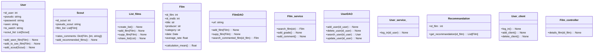

# Diagramme de classes des objets métiers

```mermaid
classDiagram
    class User {
        +id_user: int
        +pseudo: string
        +password: string
        +seen: string
        +to_watch: string
        +scout_list: List[Scout]
        +add_seen_film(Film): None
        +add_to_see_film(Film): None
        +add_scout(Scout): None
    }

    class Scout {
        +id_scout: int
        +pseudo_scout: string
        +film_list: List[Film]
        +rates_comments: Dict(Film, [int, string])
        +add_recommended_films(): None

    }

    class List_films {
        +create_list(): None
        +add_film(Film):None
        +supp_film(Film): None
        +share_list(List): None
    }

    class Film {
      +id_film: int
      +id_tmdb: int
      +title: str
      +producer: str
      +category: str
      +date: Date
      +average_rate: float
      +calculation_mean(): float
    }

    class FilmDAO {
      +url: string
      +add_film(Film): None
      +supp_film(Film): None
      +search_commented_film(id_film): Film
    }

    class Film_service {
      +search_film(str): Film
      +add_grade(): None
      +add_comment(): None
    }

    class UserDAO{
      +add_user(id_user): None
      +delete_user(id_user): None
      +search_user(id_user): User
      +update_user(id_user): None
    }

    class User_service_{
      +log_in(id_user): None
    }

    class Recommandation{
      +id_film : int
      +get_recommandation(id_film): List[Film]
    }

    class User_client{
      +log_in(): None
      +add_client(): None
      +delete_client(): None
    }

    class Film_controller{
      +details_film(id_film): None
    }


```
