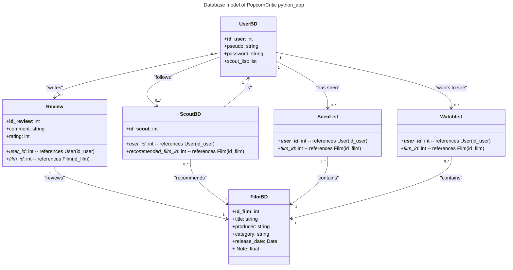

# Database model 

```mermaid
---
title: Database model of PopcornCritic python_app
---

classDiagram
    class UserBD {
        +__id_user__: int
        +pseudo: string
        +password: string
        +scout_list: list
    }

    class FilmBD {
        +__id_film__: int
        +title: string
        +producer: string
        +category: string
        +release_date: Date
        + Note: float
    }

    class Review {
        +__id_review__: int
        +comment: string
        +rating: int
        +*user_id*: int  -- references User(id_user)
        +*film_id*: int  -- references Film(id_film)
    }

    class ScoutBD {
        +__id_scout__: int
        +*user_id*: int  -- references User(id_user)
        +*recommended_film_id*: int  -- references Film(id_film)
    }

    class Watchlist {
        +__*user_id*__: int  -- references User(id_user)
        +*film_id*: int  -- references Film(id_film)
    }

    class SeenList {
        +__*user_id*__: int  -- references User(id_user)
        +*film_id*: int  -- references Film(id_film)
    }

    %% Relations avec cardinalités UML

    UserBD "1" --> "0..*" Review : "writes"
    UserBD "1" --> "0..*" SeenList : "has seen"
    UserBD "1" --> "0..*" Watchlist : "wants to see"


   
    Review "1" --> "1" FilmBD : "reviews"
    ScoutBD "1" --> "1" UserBD : "is"
    UserBD "0..*" --> "0...*" ScoutBD: "follows"
    ScoutBD "0..*" --> "1" FilmBD : "recommends"
    SeenList "0..*" --> "1" FilmBD : "contains"
    Watchlist "0..*" --> "1" FilmBD : "contains"

```
