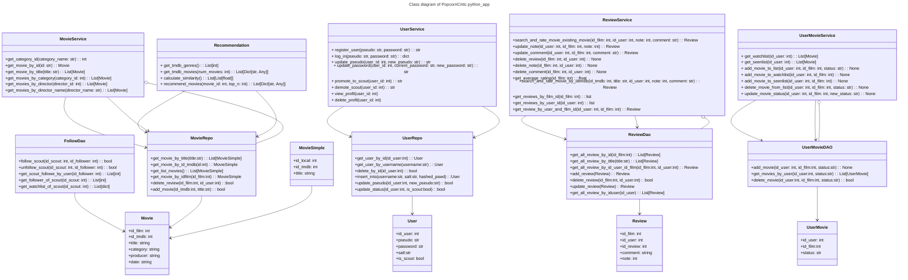

# Class diagramm

```mermaid
---
title: Class diagram of PopcornCritic python_app
---

classDiagram
    %% Dao Layer
    class FollowDao {
        +follow_scout(id_scout: int, id_follower: int): bool
        +unfollow_scout(id_scout: int, id_follower: int): bool
        +get_scout_followe_by_user(id_follower: int): List[int]
        +get_follower_of_scout(id_scout: int): List[int]
        +get_watchlist_of_scout(id_scout: int): List[dict]
    }

    class ReviewDao {
        +get_all_review_by_id(id_film:int): List[Review]
        +get_all_review_by_title(title:str): List[Review]
        +get_all_review_by_id_user_id_film(id_film:int, id_user:int): Review
        +add_review(Review): Review
        +delete_review(id_film:int, id_user:int):bool
        +update_review(Review):Review
        +get_all_review_by_iduser(id_user): List[Review]
    }

    class MovieRepo {
        +get_movie_by_title(title:str): List[MovieSimple]
        +get_movie_by_id_tmdb(id:int): MovieSimple
        +get_list_movies(): List[MovieSimple]
        +get_movie_by_idfilm(id_film:int): MovieSimple
        +delete_review(id_film:int, id_user:int):bool
        +add_movie(id_tmdb:int, title:str): bool
    }

    class UserMovieDAO {
        +add_movie(id_user: int, id_film:int, status:str): None
        +get_movies_by_user(id_user:int, status:str): List[UserMovie]
        +delete_movie(id_user:int, id_film:int, status:str): bool
    }

    class UserRepo {
        +get_user_by_id(id_user:int): User
        +get_user_by_username(username:str): User
        +delete_by_id(id_user:int): bool
        +insert_into(username:str, salt:str, hashed_pswd):User
        +update_pseudo(id_user:int, new_pseudo:str):bool
        +update_status(id_user:int, is_scout:bool):bool
    }

    %% Models
    class Movie {
        +id_film: int
        +id_tmdb: int
        +title: string
        +category: string
        +producer: string
        +date: string
    }

    class MovieSimple {
        +id_local: int
        +id_tmdb: int
        +title: string
    }

    class Review {
        +id_film: int
        +id_user: int
        +id_review: int
        +comment: string
        +note: int
    }

    class User {
        +id_user: int
        +pseudo: str
        +password: str
        +salt:str
        +is_scout: bool
    }

    class UserMovie {
        +id_user: int
        +id_film:int
        +status: str
    }


    %% Service
    class MovieService {
        +get_category_id(category_name: str): int
        +get_movie_by_id(id: str): Movie
        +get_movie_by_title(title: str): List[Movie]
        +get_movies_by_category(category_id: int): List[Movie]
        +get_movies_by_director(director_id: int): List[Movie]
        +get_movies_by_director_name(director_name: str): List[Movie]
    }

    class UserService {
        + register_user(pseudo: str, password: str) : str
        + log_in(pseudo: str, password: str) : dict
        + update_pseudo(user_id: int, new_pseudo: str) : str
        + update_password(user_id: int, current_password: str, new_password: str) : str
        + promote_to_scout(user_id: int) : str
        + demote_scout(user_id: int) : str
        + view_profil(user_id: int)
        + delete_profil(user_id: int)
    }

    class ReviewService {
        +search_and_rate_movie_existing_movie(id_film: int, id_user: int, note: int, comment: str) : Review
        +update_note(id_user: int, id_film: int, note: int) : Review
        +update_comment(id_user: int, id_film: int, comment: str) : Review
        +delete_review(id_film: int, id_user: int) : None
        +delete_note(id_film: int, id_user: int) : None
        +delete_comment(id_film: int, id_user: int) : None
        +get_average_rating(id_film: int) : float
        +search_and_rate_movie_by_idtmdb(id_tmdb: int, title: str, id_user: int, note: int, comment: str) : Review
        +get_reviews_by_film_id(id_film: int) : list
        +get_reviews_by_user_id(id_user: int) : list
        +get_review_by_user_and_film_id(id_user: int, id_film: int) : Review
    }

    class Recommendation {
        + get_tmdb_genres() : List[int]
        + get_tmdb_movies(num_movies: int) : List[Dict[str, Any]]
        + calculate_similarity() : List[List[float]]
        + recommend_movies(movie_id: int, top_n: int) : List[Dict[str, Any]]
    }

    class UserMovieService {
        + get_watchlist(id_user: int) : List[Movie]
        + get_seenlist(id_user: int) : List[Movie]
        + add_movie_to_list(id_user: int, id_film: int, status: str) : None
        + add_movie_to_watchlist(id_user: int, id_film: int) : None
        + add_movie_to_seenlist(id_user: int, id_film: int) : None
        + delete_movie_from_list(id_user: int, id_film: int, status: str) : None
        + update_movie_status(id_user: int, id_film: int, new_status: str) : None
    }

    %% Relationships
FollowDao --> Movie
ReviewDao --> Review
MovieRepo --> Movie
UserMovieDAO --> UserMovie
UserRepo --> User

MovieService --> MovieRepo
UserService --> UserRepo
ReviewService --> ReviewDao
Recommendation --> MovieRepo
UserMovieService --> UserMovieDAO

MovieService --> MovieRepo
UserService --> UserRepo
ReviewService --> ReviewDao
Recommendation --> MovieRepo
UserMovieService --> UserMovieDAO

ReviewService o-- ReviewDao
MovieService o-- MovieRepo
UserMovieService o-- UserMovieDAO
MovieSimple --> Movie
```
